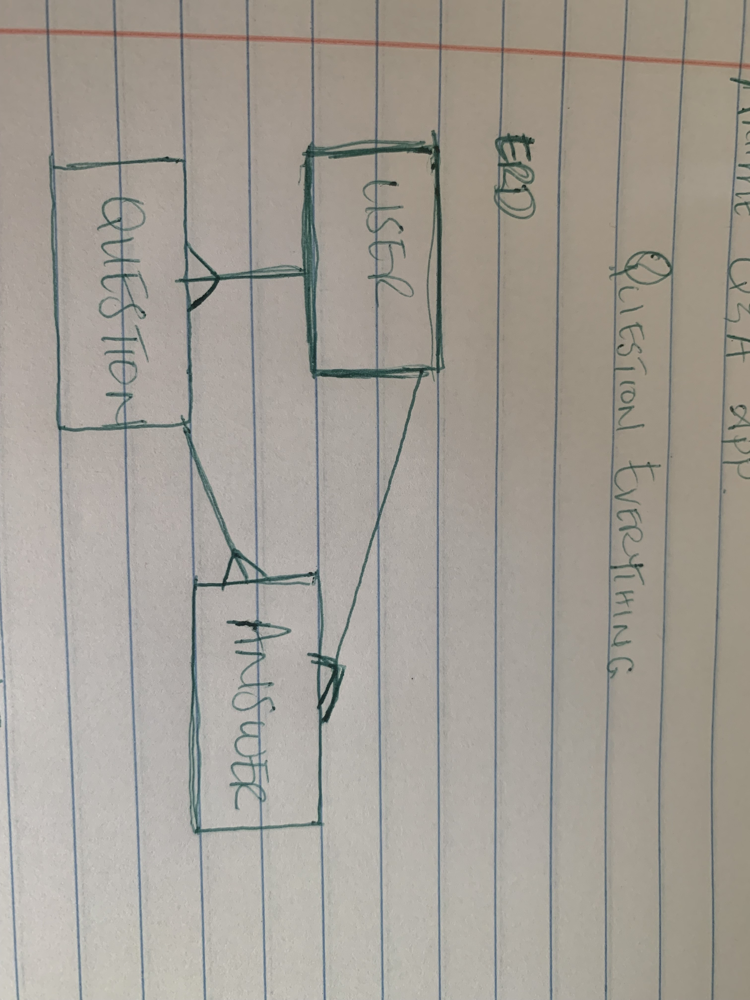

# ?UESTION EVERYTHING

## Project Description

This is an anime Q&A forum. Here, you can ask all anime-related questions, answer others' anime-related questions, and have all anime-related conversation!

## Links

* [Client Repository](https://github.com/christielewis/christielewis-Question-Everything-client)

* [Deployed Client](https://christielewis.github.io/christielewis-Question-Everything-client/)

* [Deployed Server](https://whispering-stream-83145.herokuapp.com)

## User Stories

- User will be able to sign up with:
  * user email address,
  * password, and
  * password confirmation.

- User can sign in to their account with:
  * user's email address they used upon sign up
  * user's password they used upon sign up

- User can sign out of their account, once signed in.

- User can change their password, once signed in.

- User can Create a new question with:
  * a Question as the Title.
  * a brief expansion of the question/ what they want to know (optional)
  * a number that represents the current season of the created anime
  * a number that represents the current episode of the created anime

- User can Read multiple questions that they have asked

- User can Read multiple answers that they have written

- User can Create multiple questions to be answered

- User can Create answers to others' questions

- User can Read a single question that they've asked

- User can Read a single question that they've asked with all of the answers from other users, if any

- User can Read a single answer that they've created with the question they answered

- User can Update a question that they own

- User can Update an answer that they own

- User can Delete a question that they own

- User can Delete an answer that they own

## API End Points

| Verb   | URI Pattern            | Controller#Action |
|--------|------------------------|-------------------|
| POST   | `/sign-up`             | `users#signup`    |
| POST   | `/sign-in`             | `users#signin`    |
| DELETE | `/sign-out`            | `users#signout`   |
| PATCH  | `/change-password`     | `users#changepw`  |
| GET    | `/questions`           | `questions#index` |
| POST   | `/questions`           | `questions#create`|
| GET    | `/questions/:id`       | `questions#show`  |
| PATCH  | `/questions/:id`       | `questions#update`|
| GET    | `/answers`             | `answers#index`   |
| POST   | `/answers`             | `answers#create`  |
| PATCH  | `/answers/:id`         | `answers#update`  |

## Technologies Used

* Git/GitHub
* Mongoose
* MongoDB
* Express.js
* React.js
* Node.js
* cURL
* JSON
* Axios
* SCSS/Bootstrap

## Project Planning

- Created a project proposal to present to instructional team. It contained:
  * Project description
  * In-depth user stories
  * Technologies to be used
  * Application wireframe
  * Server entity-relationship diagram

## Problem Solving

I tackled bugs in a plethora of ways throughout in the development process. Some examples are:
  * Referring to online documentation
  * Referring to previous projects
  * Referencing class trainings/coding annotations and examples
  * Leveraging instructor knowledge
  * CONSOLE.LOG()

## Entity-Relationship Diagram

### Unsolved Problems
* Indexing Answers to Questions
* Updating Answers to Questions
* Deleting Answers to Questions

#### Setup/Installation
No server-side setup required!
